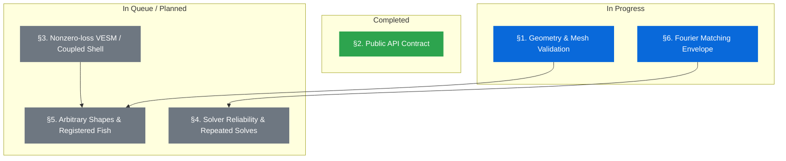

# ts_modeling

```mermaid
flowchart TD
    classDef done fill:#2da44e,color:#fff,stroke-width:0px
    classDef prog fill:#0969da,color:#fff,stroke-width:0px
    classDef queue fill:#6e7781,color:#fff,stroke-width:0px

    subgraph Complete["Completed"]
        S2["§2. Public API Contract"]:::done
    end

    subgraph Active["In Progress"]
        S1["§1. Geometry & Mesh Validation"]:::prog
        S6["§6. Fourier Matching Envelope"]:::prog
    end

    subgraph Backlog["In Queue / Planned"]
        S3["§3. Nonzero-loss VESM / Coupled Shell"]:::queue
        S5["§5. Arbitrary Shapes & Registered Fish"]:::queue
        S4["§4. Solver Reliability & Repeated Solves"]:::queue
    end

    %% Dependencies
    S1 --> S5
    S3 --> S5
    S6 --> S4
```
